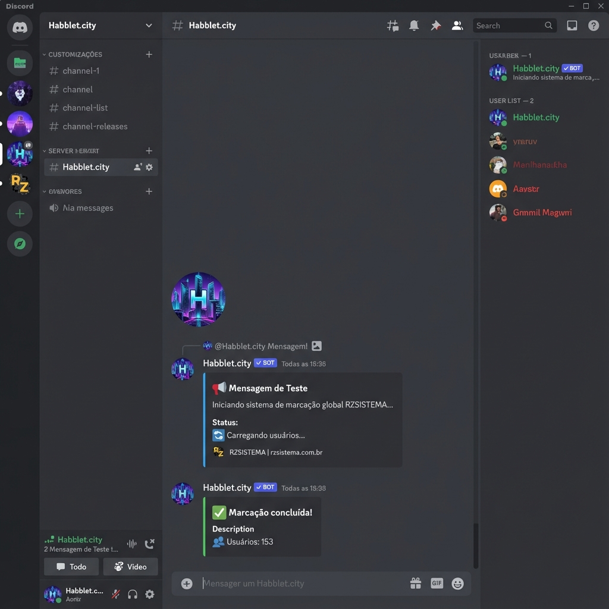

# Bots para Discord (RZSISTEMA)

Bem-vindo à coleção oficial de bots da **RZSISTEMA**. Esta suíte contém ferramentas essenciais para administração e engajamento.



## 🚀 Ferramentas Incluídas

### 1. Marcador de Pessoas (`marcapessoa.js`)

- **Função**: Menciona todos os membros (humanos) do servidor.
- **Visual**: Embed Azul "Mensagem de Teste".
- **Comando**: `node marcapessoa.js`

### 2. Marcador de Cargos (`marcacargo.js`)

- **Função**: Lista e menciona todos os Cargos (Roles).
- **Visual**: Embed Laranja "SISTEMA DE CARGOS".
- **Comando**: `node marcacargo.js`

### 3. Contador de Membros (`contador.js`)

- **Função**: Cria/Atualiza um **Canal de Voz** no topo do servidor mostrando o total de membros (ex: `📊 Membros: 250`).
- **Log**: Envia um Embed Ciano confirmando a atualização.
- **Comando**: `node contador.js`

### 4. RZLIMPEZA (`limpar.js`)

- **Função**: Faxina completa do chat com backup.
- **Segurança**: Salva log em `#logs-chat` antes de apagar.
- **Visual**: Embed Roxo "RZLIMPEZA" com banner animado.
- **Comando**: `node limpar.js`

### 5. Active Badge (`badge.js`)

- **Função**: Registra Comandos Slash (`/verificar`, `/activedevbadge`) para insígnia de Dev.
- **Log**: Responde no canal configurado com Embed Dourado.
- **Comando**: `node badge.js`

### 6. Quiz Trivia (`jogo.js`)

- **Função**: Jogo de Perguntas e Respostas com Ranking.
- **Log**: Canal restrito, 100 perguntas, ganha quem responder primeiro.
- **Comandos**:
  - `/comecarjogo`: Inicia.
  - `/pararjogo`: Cancela imediatamente.
  - `/finalizarjogo`: Encerra e mostra o pódio.
  - `/pontuacao`: Vê o placar atual.

## 🛠️ Instalação Rápida

1.  **Baixe o projeto**:
    ```bash
    git clone https://github.com/RZSISTEMAs/bots-para-discord.git
    cd bots-para-discord
    ```
2.  **Instale**: `npm install`
3.  **Token**: Crie um arquivo `.env` com `DISCORD_TOKEN=SEU_TOKEN`.
4.  **Rodar**: Escolha o script desejado e rode com `node nome_do_script.js` (ex: `node marcapessoa.js`).

## 📞 Suporte

Desenvolvido por **RZSISTEMA**.
Acesse: [rzsistema.com.br](https://rzsistema.com.br)
